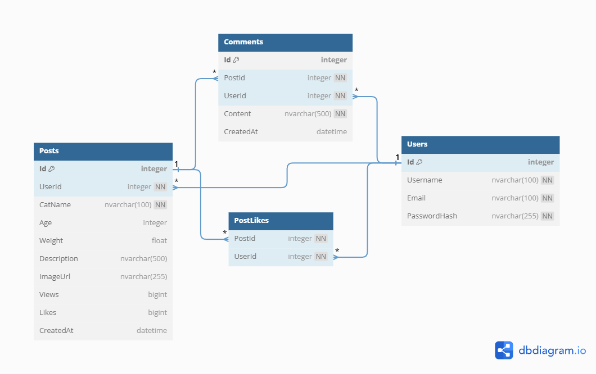

# Miau | Rede social para gatos 🐈

Bem-vindo ao **Miau**, uma rede social para amantes de gatos! Este projeto permite que usuários compartilhem fotos de seus felinos, interajam com curtidas e comentários, e explorem uma comunidade apaixonada por gatos.

## Introdução

### Descrição Geral do Projeto
O Miau é uma aplicação web que combina funcionalidades de uma rede social com o foco em gatos. Os usuários podem criar posts com fotos, nomes e descrições de seus gatos, curtir posts de outros usuários, e deixar comentários — muitas vezes sugeridos por inteligência artificial para tornar a interação mais divertida e criativa.

### Objetivos
- Criar uma plataforma simples e intuitiva para amantes de gatos compartilharem suas fotos.
- Implementar funcionalidades de interação como curtidas e comentários.
- Utilizar IA (OpenAI) para sugerir comentários criativos baseados nos posts.
- Garantir uma experiência fluida com suporte a emojis e uma arquitetura escalável.

### Escopo
O projeto abrange:
- Back-end em ASP.NET Core com Entity Framework Core e SQL Server.
- Integração com IA para sugestões de comentários.
- Suporte a upload de imagens via Cloudinary.
- Autenticação via JWT.
- Front-end com React.js.

## Banco de Dados

### Diagrama de Entidade-Relacionamento
O banco de dados do Miau é projetado para suportar usuários, posts e interações (curtidas e comentários). Abaixo está o modelo ER:



#### Tabelas
- **Users**: Armazena informações dos usuários.
  - `Id` (PK, int)
  - `Username` (nvarchar(100))
  - `Email` (nvarchar(100))
  - `PasswordHash` (nvarchar(255))
- **Posts**: Representa os posts de gatos.
  - `Id` (PK, int)
  - `UserId` (FK, int, references Users)
  - `CatName` (nvarchar(100))
  - `Age` (int)
  - `Weight` (float)
  - `Description` (nvarchar(500))
  - `ImageUrl` (nvarchar(255))
  - `Views` (int)
  - `Likes` (int)
  - `CreatedAt` (datetime)
- **Comments**: Comentários em posts.
  - `Id` (PK, int)
  - `PostId` (FK, int, references Posts, ON DELETE CASCADE)
  - `UserId` (FK, int, references Users)
  - `Content` (nvarchar(500))
  - `CreatedAt` (datetime)
- **PostLikes**: Registro de curtidas.
  - `UserId` (FK, int, references Users)
  - `PostId` (FK, int, references Posts, ON DELETE CASCADE)
  - (PK composta: UserId, PostId)

#### Notas
- `Content` em `Comments` usa `NVARCHAR` para suportar emojis Unicode (ex.: `😻🐾`).
- Relações com `ON DELETE CASCADE` garantem que curtidas e comentários sejam excluídos automaticamente ao deletar um post.

## Visão Geral do Sistema

### Arquitetura do Sistema
O Miau segue uma arquitetura em camadas baseada no **Repository Pattern**, com:
- **Back-end**: ASP.NET Core Web API.
- **Banco de Dados**: SQL Server com Entity Framework Core.
- **Front-end**: React.js.
- **Serviços Externos**: Cloudinary para upload de imagens e Azure Inference/OpenAI para sugestões de comentários.

[Imagem: Diagrama da arquitetura mostrando camadas e fluxo de dados]

### Funcionalidades
- Cadastro e login de usuários.
- Criação, visualização, edição e exclusão de posts.
- Curtidas em posts (toggle like).
- Comentários em posts, com sugestões geradas por IA.
- Incremento de visualizações ao acessar detalhes de um post.

## Desenvolvimento

### Estrutura do Projeto
```
Miau/
├── miau-webapi/             # Projeto ASP.NET Core
│   ├── Controllers/         # Controllers da API
│   ├── Models/              # Modelos de dados (entidades)
│   ├── Repositories/        # Implementação do Repository Pattern
│   ├── Services/            # Lógica de negócios
│   ├── Data/                # Contexto do EF Core
│   └── Program.cs           # Configuração da aplicação
├── miau-app/                # [Adicionar informação: Estrutura do front-end]
│   ├── src
│   │   ├── Assets           # Arquivos estáticos e imagens utilizadas dentro do projeto
│   │   ├── Components       # Componentes reutilizáveis da interface de usuário (UI)
│   │   ├── Hooks            # Hooks personalizados do React para reutilizar lógica de estado/efeitos
│   │   ├── api.jsx          # Configuração dos endpoints da API para consumo pelo front-end
│   │   ├── App.jsx          # Componente principal, configuração de rotas
│   │   ├── UserContext.jsx  # Contexto global para gerenciar informações do usuário autenticado
```

### Descrição das Camadas
- **Apresentação (Controllers)**: Endpoints da API que recebem requisições HTTP.
- **Domínio (Models)**: Classes que representam as entidades do banco (ex.: `Post`, `Comment`).
- **Repositório (Repositories)**: Abstrai o acesso ao banco com o Repository Pattern.
- **Serviços (Services)**: Contém a lógica de negócios, como validações e chamadas à IA.

#### Repository Pattern
O **Repository Pattern** foi adotado para separar a lógica de acesso a dados da lógica de negócios, promovendo:
- **Abstração**: O `IPostRepository` define métodos como `CreatePost`, `GetPostById`, e `CreateComment`.
- **Testabilidade**: Facilita a substituição do acesso real ao banco por mocks em testes.
- **Manutenção**: Centraliza as queries e operações de banco.

Exemplo de `IPostRepository`:
```csharp
public interface IPostRepository
{
    Task<Post> CreatePost(Post post);
    Task<Post> GetPostById(int postId);
    Task<CommentModel> CreateComment(int userId, int postId, string content);
    Task<bool> DeletePost(int postId);
}
```

Implementação em `PostRepository`:
```csharp
public async Task<CommentModel> CreateComment(int userId, int postId, string content)
{
    var createdAt = DateTime.UtcNow;
    var newIdParam = new SqlParameter("@NewId", SqlDbType.Int) { Direction = ParameterDirection.Output };

    await _context.Database.ExecuteSqlRawAsync(
        "EXEC sp_CreateComment @UserId, @PostId, @Content, @CreatedAt, @NewId OUTPUT",
        new SqlParameter("@UserId", userId),
        new SqlParameter("@PostId", postId),
        new SqlParameter("@Content", SqlDbType.NVarChar, 500) { Value = content },
        new SqlParameter("@CreatedAt", createdAt),
        newIdParam
    );

    var newId = (int)newIdParam.Value;
    return new CommentModel { Id = newId, UserId = userId, PostId = postId, Content = content, CreatedAt = createdAt };
}
```

Implementação Stored Procedure:

```
CREATE PROCEDURE sp_CreateComment
    @UserId INT,
    @PostId INT,
    @Content NVARCHAR(500),
    @CreatedAt DATETIME,
    @NewId INT OUTPUT
AS
BEGIN
    INSERT INTO Comments (UserId, PostId, Content, CreatedAt)
    VALUES (@UserId, @PostId, @Content, @CreatedAt);
    
    SET @NewId = SCOPE_IDENTITY();
END;
```

## API

### Documentação da API
A API é documentada com Swagger (acessível em `/swagger`).

#### Exemplos Endpoint: Criar Comentário
- **Método**: `POST /api/posts/{postId}/comments`
- **Autenticação**: JWT
- **Parâmetros**:
  - `postId` (path, int): ID do post.
  - `content` (body, string): Conteúdo do comentário.
- **Exemplo de Requisição**:
  ```json
  {
      "content": "Que fofura! 😻"
  }
  ```
- **Exemplo de Resposta**:
  ```json
  {
      "id": 1,
      "postId": 1,
      "userId": 2,
      "content": "Que fofura! 😻",
      "createdAt": "2025-04-06T12:00:00Z"
  }
  ```

#### Endpoint: Sugestão de Comentário
- **Método**: `GET /api/posts/{postId}/comment-suggestion`
- **Autenticação**: JWT
- **Resposta**:
  ```json
  {
      "suggestion": "Toddynho é um charme! 🐾✨"
  }
  ```

---

## Interface do Usuário

### Descrição das Funcionalidades da Interface
- **Feed**: Lista de posts com fotos de gatos.
- **Detalhes do Post**: Exibe imagem, descrição, detalhes do gato, curtidas, visualizações e comentários.
- **Botão de Sugestão**: Gera comentários via IA ao clicar.
- **Perfil de um Usuário**: Mostra posts de um determiado usuário.
- **Criação de posts**: Layout para criação de posts, com visualização da imagem postada em tempo real.

[Imagem: Captura de tela do feed de posts]

---

## Considerações Finais

### Lições Aprendidas
- Configurar `NVARCHAR` foi essencial para suportar emojis.
- O Repository Pattern facilitou a manutenção do código.
- Ajustes na desserialização JSON foram necessários para preservar Unicode.

### Melhores Práticas
- Usar `ON DELETE CASCADE` para integridade referencial.
- Tratar codificação UTF-8/UTF-16 em toda a pipeline.
- Adotar logs para debug de problemas complexos.

### Próximos Passos
- Adicionar suporte a notificações.
- Implementar filtros no feed.

## Anexos

### Referências e Recursos Adicionais
- [Documentação ASP.NET Core](https://docs.microsoft.com/aspnet/core)
- [Entity Framework Core](https://docs.microsoft.com/ef/core)

### Links Úteis
- [Cloudinary](https://cloudinary.com/documentation)
- [OpenAI API](https://platform.openai.com/docs)

